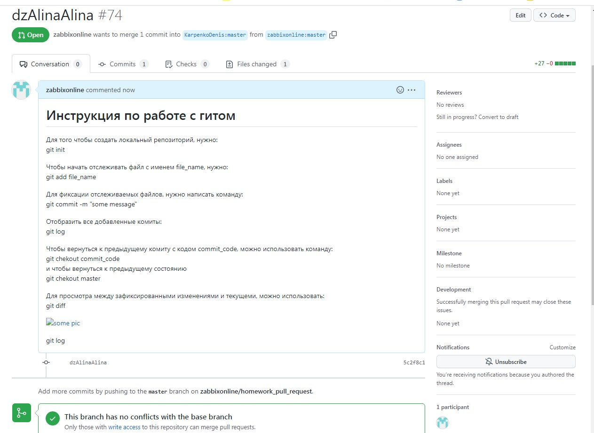

# Инструкция по работе с гитом
Для того чтобы создать локальный репозиторий, нужно:
git init

Чтобы начать отслеживать файл с именем file_name, нужно:
git add file_name

Для фиксации отслеживаемых файлов, нужно написать команду:
git commit -m "some message"

Отобразить все добавленные комиты:
git log

Чтобы вернуться к предыдущему комиту с кодом commit_code, можно использовать команду:
git chekout commit_code
и чтобы вернуться к предыдущему состоянию
git chekout master

Для просмотра между зафиксированными изменениями и текущеми, можно использовать:
git diff

git log –graph Опция --graph добавляет ASCII-граф, показывающий историю ветвлений и слияний.

git clone клонирует из общего репозитория в локальный

git pull Команда git pull используется для извлечения и загрузки содержимого из удаленного репозитория и немедленного обновления локального репозитория этим содержимым. Слияние удаленных вышестоящих изменений в локальный репозиторий — это обычная задача рабочего процесса, возникающая при совместной работе на основе системы Git.

git push Команда git push используется для выгрузки содержимого локального репозитория в удаленный репозиторий. Она позволяет передать коммиты из локального репозитория в удаленный.

git status показывает статус локального репозитория
