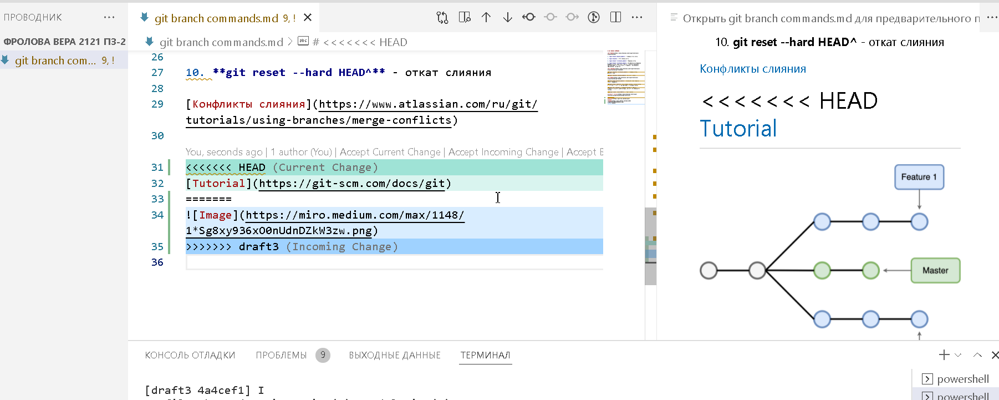

# **1. Основные команды**

## Настройки git

>* **git version** - вывести версию программы git
>
>* **git config --global user.name « *FirstName.LastName* »** - сообщить программе своё имя
>
>* **git config --global user.email *<your_mail@example.com>*** - сообщить программе свой e-mail
>
>* **git config --global user.name** - вывести на экран сохранённое в программе имя пользователя
>
>* **git config --global user.email** - вывести на экран сохранённый в программе e-mail пользователя

## Смена редактора

>* **git config --global core.editor "code --wait"** - VS Code
>
>* **git config --global core.editor "nano -w"** - Nano
>
>* **git config --global core.editor "'c:/program files/Notepad++/notepad++.exe' -multiInst -notabbar -nosession -noPlugin"** - Notepade++
>
>* **git config --global core.editor "vim"** - Vim

## Начало работы с репозиториями

>* **git init** - создать репозиторий в папке для отслеживания изменений файлов
>
>* **git status** - узнать, какие изменения произошли
>
>* **git add  *<file.name>*** - индексация измененного файла, либо оповещение о
создании нового (после ввода первых двух символов имени отредактированного файла можно нажать TAB)
>
>* **git add .** - внести в индекс все изменения, включая новые файлы
>
>* **git commit -m " *< message>* "** - зафиксировать изменения, сопроводив их комментарием
>
>* **git log** - просмотр журнала изменений
>
>* **git checkout <????>** - переход к версии, коммит которой начинается с указанных в команде четырех (или более) символов
>
>* **git checkout master** - возврат к актуальной версии файла
>
>* **git diff** - показ разницы между текущим состоянием файла и сохраненным
>
# **2. Работа с ветками**

## [branch](https://www.atlassian.com/ru/git/tutorials/using-branches)

1. **git branch *branch_name*** - создание новой ветки

2. **git branch** - вывод списка веток

3. **git branch -d *branch_name*** - удаление ветки

4. **git branch -D *branch_name*** - принудительное удаление указанной ветки, даже если в ней есть неслитые изменения: навсегда удаляются все коммиты, связанные с определенным направлением разработки

## [checkout](https://www.atlassian.com/ru/git/tutorials/using-branches/git-checkout)

5. **git checkout -b *branch_name*** - создание ветки, переход в неё

6. **git checkout *branch_name*** - просмотр ветки

## [merge](https://www.atlassian.com/ru/git/tutorials/using-branches/git-merge)

7. **git merge *branch_name*** - слияние просматриваемой ветки с указанной

8. **git merge --abort** - прерывание слияния, возврат ветки к состоянию, в котором она находилась до начала слияния

9. **git log --merge** - создание журнала со списком конфликтов коммитов между ветками, для которых выполняется слияние

10. **git reset --hard HEAD^** - откат слияния

## [Конфликты слияния](https://www.atlassian.com/ru/git/tutorials/using-branches/merge-conflicts)

Конфликты слияния веток возникат у разработчика, который выполняет слияние, если одни и те же строки файла в них различаются, или удаляется файл, который в это время изменяет другой разработчик

[Tutorial](https://git-scm.com/docs/git)

# **3. Работa с удалёнными репозиториями**

>* **git log –graph** - графическое отображение истории коммитов
>
>* **git clone** - создание копии удалённого репозитория
>
>* **git pull** - загрузка из удалённого репозитория в локальный
>
>* **git push** - запись данных в удалённый репозиторий
